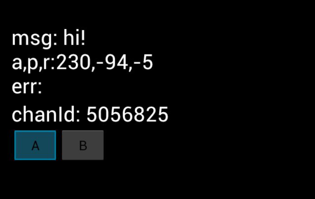
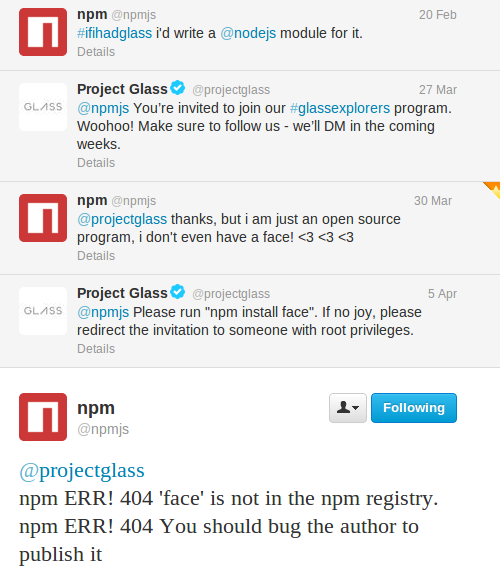

Face
====

Side loadable app to bi-directionally communicate from Google Glass to a websocket 




## How it works

When the app is loaded onto a Google Glass device, it makes a connection to a simple [Reflector websocket server](https://github.com/monteslu/reflector)  and recevies a channel Id upon connection.  It then immedieately begins streaming sensor data and receiving incoming messages from other clients.

The heads up display shows any incoming messages, the gyrosocpe values (azimuth, pitch, roll), any error messages, and a channel Id.
The channel Id can be used by other web applications to connect to the same websocket channel for private notifications.


There are also two buttons that can be clicked from the Glass' track pad.  They will broadcast an event with an 'A' or 'B' value respectively to each client connected on the same channel.


## Usage

The Glass broadcasts sensor data messages to all connected clients under the 'broadcast' topic.  The data is formatted as:
```javascript
{
  "id":"3381972", //the channel it's broadcasting on
  "sensors":{
    "pitch":-95.88117980957031,
    "roll":-1.8725770711898804,
    "azimuth":283.96575927734375
  }
}
```

If a wink is detected by Glass, it will broadcast a wink event on the broadcast topic:
```javascript
{
  "id":"3381972",
  "event":"wink"
}
```

If the A button is clicked on the Glass, it will broadcast an "A" event on the broadcast topic:
```javascript
{
  "id":"3381972",
  "event":"A"
}
```


If you want to send a message to Glass to be displayed directly on the Glass display:
```javascript
socket.emit('broadcast', {
  "id":"3381972",
  "msg":"hello, glass!"
});
```

If you want the client to tell the Glass to take a picture:
```javascript
socket.emit('broadcast', {
  "id":"3381972",
  "action":"camera"
});
```


## Why?


[](https://twitter.com/npmjs/status/320570485127667713)


## License

The MIT License (MIT)

Copyright (c) 2013 Iced Development, LLC

Permission is hereby granted, free of charge, to any person obtaining a copy of this software and associated documentation files (the "Software"), to deal in the Software without restriction, including without limitation the rights to use, copy, modify, merge, publish, distribute, sublicense, and/or sell copies of the Software, and to permit persons to whom the Software is furnished to do so, subject to the following conditions:

The above copyright notice and this permission notice shall be included in all copies or substantial portions of the Software.

THE SOFTWARE IS PROVIDED "AS IS", WITHOUT WARRANTY OF ANY KIND, EXPRESS OR IMPLIED, INCLUDING BUT NOT LIMITED TO THE WARRANTIES OF MERCHANTABILITY, FITNESS FOR A PARTICULAR PURPOSE AND NONINFRINGEMENT. IN NO EVENT SHALL THE AUTHORS OR COPYRIGHT HOLDERS BE LIABLE FOR ANY CLAIM, DAMAGES OR OTHER LIABILITY, WHETHER IN AN ACTION OF CONTRACT, TORT OR OTHERWISE, ARISING FROM, OUT OF OR IN CONNECTION WITH THE SOFTWARE OR THE USE OR OTHER DEALINGS IN THE SOFTWARE.
